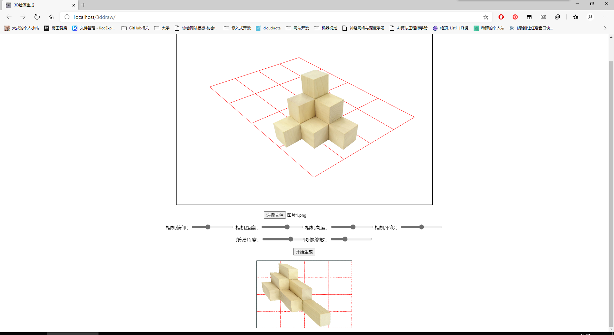
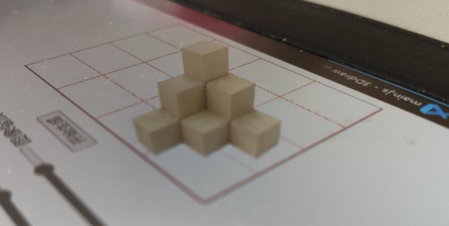

# 3D绘画生成小程序

使用地址：https://imuncle.github.io/3Ddraw/

这是一个可以自动生成3D绘画的程序。关于3D绘画可以直接百度图片搜索，很有意思。

`avatar.jpg`是我高中创作的第一幅3D绘画，后来上了大学因为时间关系，已经许久没有画过立体画了。

这是我在武汉新型肺炎肆意的期间在家写的一个小demo，界面如下：



首先需要导入图片，然后调整相机位置到合适的角度，最后点击生成，即可得到一张3D绘画图片（默认是A4纸比例）。

用相机拍摄生成的图片效果如下：



enjoy!

# 更新日志

## V1.0
* 实现基本功能，可以调节相机角度、高度、距离，纸张角度等
* 可添加单张图片
* 可显示栅格，更方便调整纸张角度以适应图片
* 一键生成3D模型

## V1.1
* 纸张可90度折叠，带来更多的3D体验
* 可手动添加空间点。
打开命令行输入以下命令即可。
```javascript
draw.model.add_point([x, y, z]);    // x, y, z是空间点的三维坐标
```
空间点坐标系以纸张左下角为原点，建立x轴向左、z轴向上的右手坐标系。

单个点不会显示，程序显示的是空间点之间的连线，所以如果要画图形，应当以线段两端点的组合依次输入。比如下列代码实现了向空间中手动添加一个方框。

```javascript
//line 1
draw.model.add_point([0,0,50]);
draw.model.add_point([0,50,50]);

//line 2
draw.model.add_point([0,50,50]);
draw.model.add_point([50,50,50]);

//line 3
draw.model.add_point([50,50,50]);
draw.model.add_point([50,0,50]);

//line 4
draw.model.add_point([50,0,50]);
draw.model.add_point([0,0,50]);
```